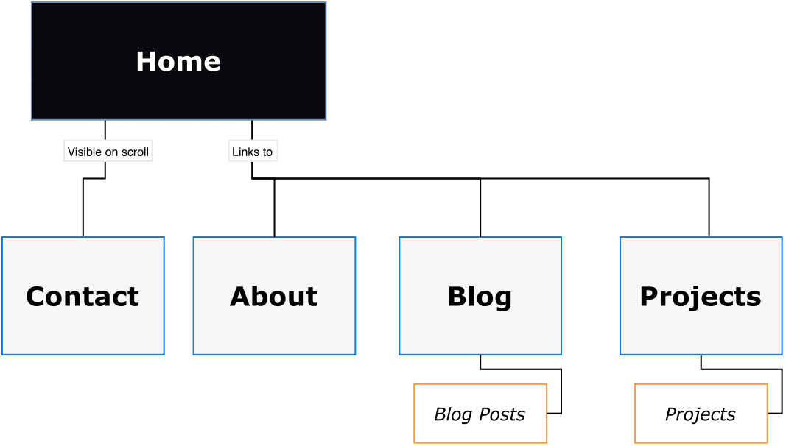
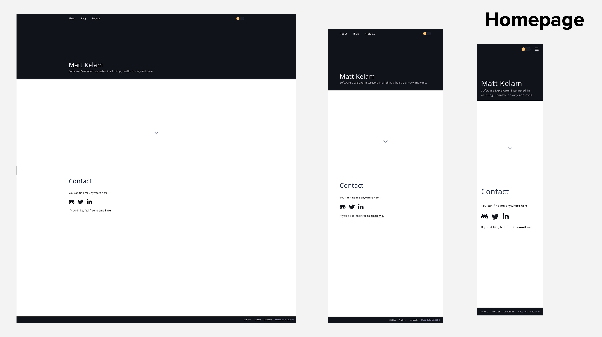
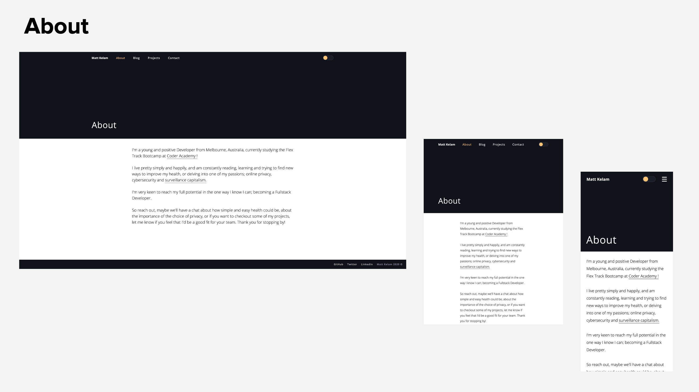
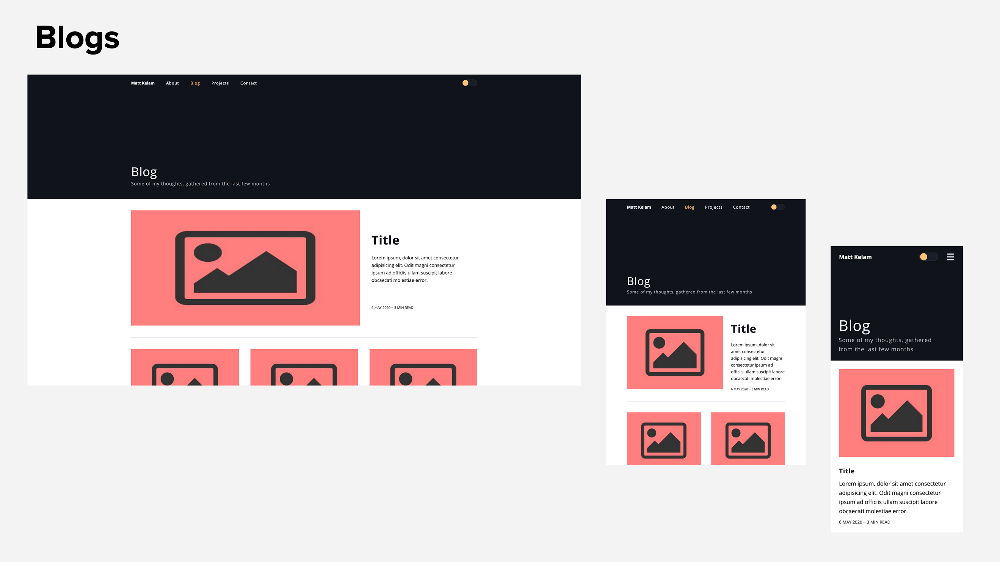
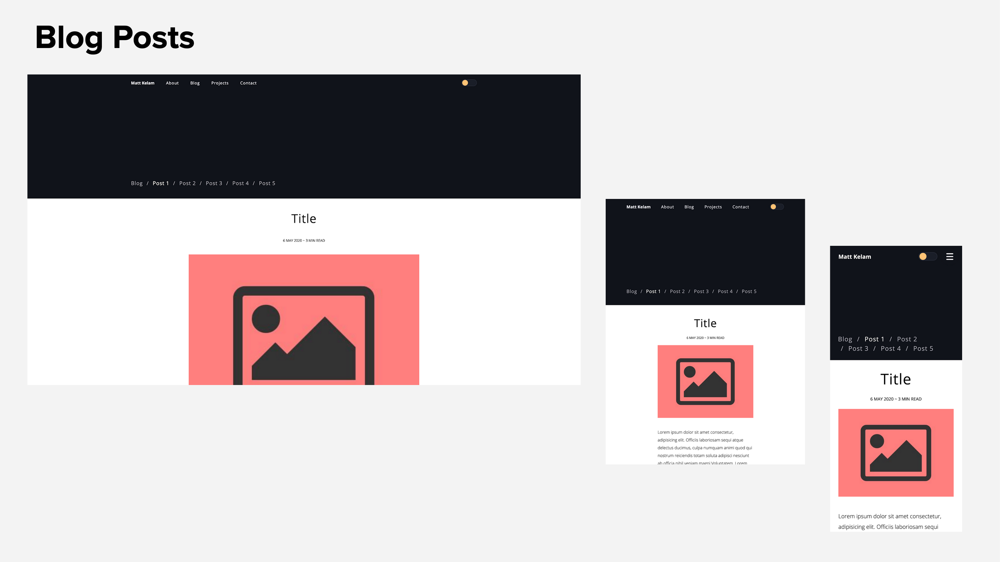
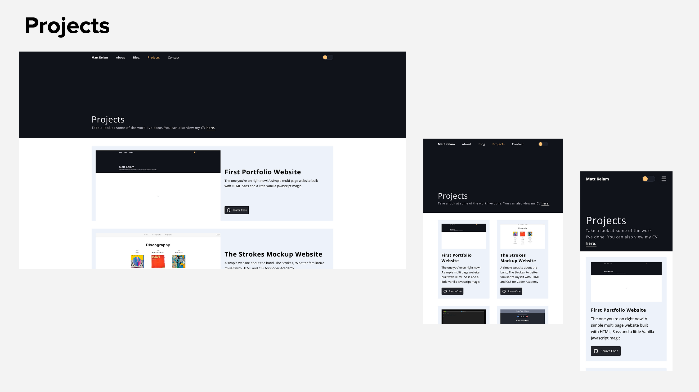

# Matt Kelam - Portfolio Website

Deployed site: [https://mattkelam.netlify.app](https://mattkelam.netlify.app/)

Repository: [https://github.com/maaronkel/Portfolio](https://github.com/maaronkel/Portfolio)

---

## Description

This repository contains my first portfolio written in HTML, SCSS and a little vanilla Javascript. The repo contains all the source code, documentation and the presentation.

### Brief

Create a portfolio website which presents you as a dev and IT professional. The purpose is to provide an online portfolio that provides information about you, your skills, interests, professional knowledge and a showcase of your work.

---

## Purpose

The purpose of this website is to showcase to potential employers my current programming skills, abilities and projects I’ve completed. It is intended to also provide a means to contact me through my professional dev and social accounts, as well as an insight into my personality and interests.

---

## Functionality / Features

The website was built mobile first with responsiveness in mind, which enabled the development process to be pretty smooth and allowing me to quickly create and style every page.

Throughout each page, components are used to drastically enhance the efficiency 

Some of the features include:

  - *Simple design*, as to not deter away from the content on the pages, I wanted to create a website that I would enjoy viewing, and was professional and clean enough that it would be approachable to anyone, including potential employers

  - *Light / Dark Theme toggle* which is mainly a gimmick as it doesn’t save the colour choice when you switch pages, but it does add a nice accent colour to the header to offset the navbar links.

  - *Quick Social and Navigation Links* where the navbar is clear and present on every page, and the footer displays social links for easy access

  - *Reusable Components*, where almost every part of the website is a component used somewhere else, allowing changing of styles or adding new content extremely easy

  Some of the reusable components include:
    
  - A Container component that I used to style the layout of every page, in which I had two variations, one for allowing the height to grow depending on the content on the page, and the other for when i needed a fixed window height - both using the exact same code, only difference being one had `height: auto` and the other `height: 100vh` - making it extremely easy to create new pages that look semantically the same, depending on the content on said page.

  - A Header component that quickly allows me to copy and paste it for every page, only changing the content

  - A Blog Post and Projects component that made creating different posts or projects with CSS Grid very easy while keeping them uniform, as well as making it easy to adjust the Grid containers inside each when writing media queries - which I had a bit of fun with in changing the layout of each depending on screen size

---

## Sitemap

## Screenshots of the Website

---

## Target Audience

The targeted audience is potential employers from software development companies in Melbourne.

---

## Tech Stack Used

I built this project using:

  - Balsamiq Wireframes (Mockups)
  - HTML5
  - CSS3
  - SASS (SCSS)
  - Javascript
  - Git
  - Netlify deployment